# Deploy build agent
 
Now the build agent VM image is built and stored in Azure Storage. The last step is to deploy the agent using Azure DevOps Release Pipeline.

1. From menu select **Pipelines** then **Releases**.
2. Click **New release pipeline**.
3. Select **Empty job** (no template).
4. Select **Variables** tab and enter following variables:

| Name                           | Value                                                      | Hidden | Scope   |
|--------------------------------|------------------------------------------------------------|--------|---------|
| Azure.ServicePrincipalObjectId | Value of $spClientId returned by _SetupPacker.ps1_ script. | true   | Release |
| Azure.VirtualMachinePrefix     | Prefix that will be added to VM name. For example, when prefix is _VSBuild1V_, then VM is named VSBuild1V*X*R (X is release number). |        | Release |

5. Open **Variable groups** and link following variable groups: Azure resources, Build Agent properties, Azure DevOps Account

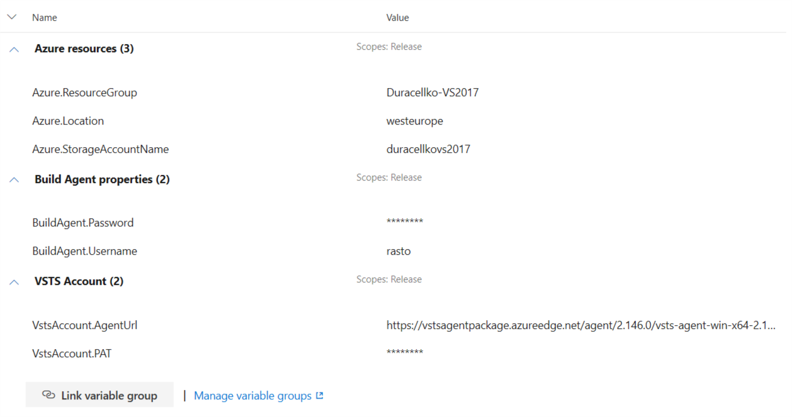

6. Open **Pipeline** tab.
7. Click **Add artifact**.
8. Set following properties:
    - **Project**: Current Azure DevOps project
    - **Source (build pipeline)**: Build Agent Image
    - **Default version**: Latest
    - **Source alias**: AgentImage
9. Click **Add**.

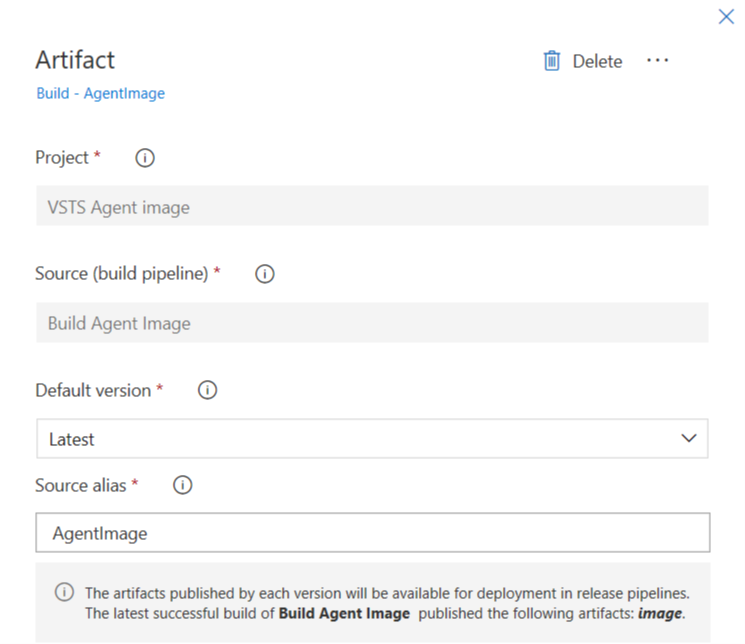

10. Click **Add artifact**.
11. Set following properties:
    - **Project**: Current Azure DevOps project
    - **Source (build pipeline)**: Build Scripts
    - **Default version**: Latest from the build pipeline default branch with tags
    - **Tags**: _empty_
    - **Source alias**: BuildScripts
12. Click **Add**.

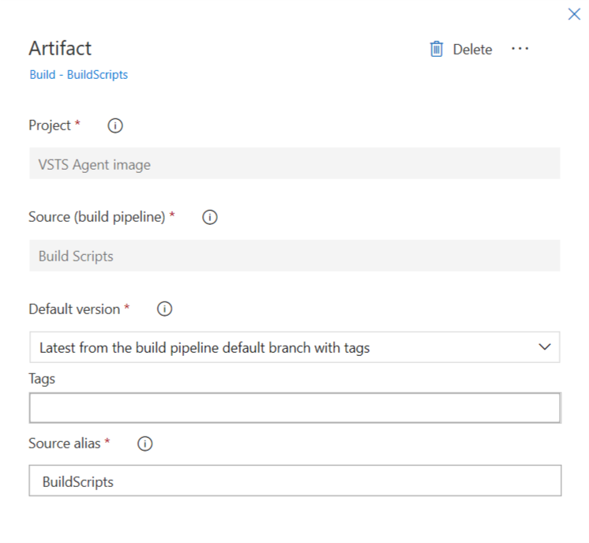

13. Select stage in the release and change name to _Azure DevOps Default Queue_.

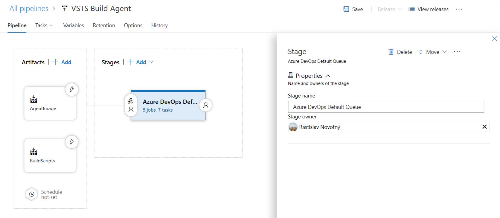

14. Open **Tasks** tab.
15. Select first job and set following properties:
    - **Display name**: Create virtual machine
    - **Agent pool**: Default

16. Add task **Azure PowerShell** and set properties:
    - **Display name**: Clean up Azure virtual machines
    - **Azure Connection Type**: Azure Resource Manager
    - **Azure Subscription**: Azure Build
    - **Script Type**: Script File Path
    - **Script Path**: `$(System.DefaultWorkingDirectory)/BuildScripts/deploy/DeleteVMs.ps1`
    - **Script Arguments**: `-RGName "$(Azure.ResourceGroup)" -ExceptVMs @("$(Agent.MachineName)")`
    - **ErrorActionPreference**: Stop
    - **Azure PowerShell Version**: Latest installed version

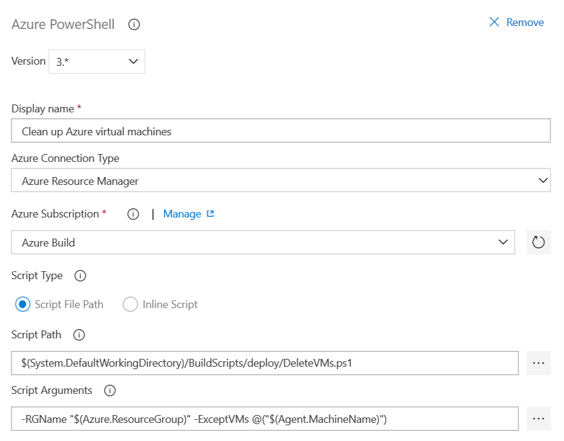

17. Add task **Azure PowerShell** and set properties:
    - **Display name**: Create virtual machine
    - **Azure Connection Type**: Azure Resource Manager
    - **Azure Subscription**: Azure Build
    - **Script Type**: Script File Path
    - **Script Path**: `$(System.DefaultWorkingDirectory)/BuildScripts/deploy/CreateVM.ps1`
    - **Script Arguments**: `-RGName "$(Azure.ResourceGroup)" -Location "$(Azure.Location)" -VHDUriFile "$(System.DefaultWorkingDirectory)\AgentImage\image\ImageOutput.txt" -VMName "$(Azure.VirtualMachinePrefix)$(Release.ReleaseId)R" -Username "$(BuildAgent.Username)" -Password "$(BuildAgent.Password)" -ServicePrincipalObjectId "$(Azure.ServicePrincipalObjectId)"`
    - **ErrorActionPreference**: Stop
    - **Azure PowerShell Version**: Latest installed version

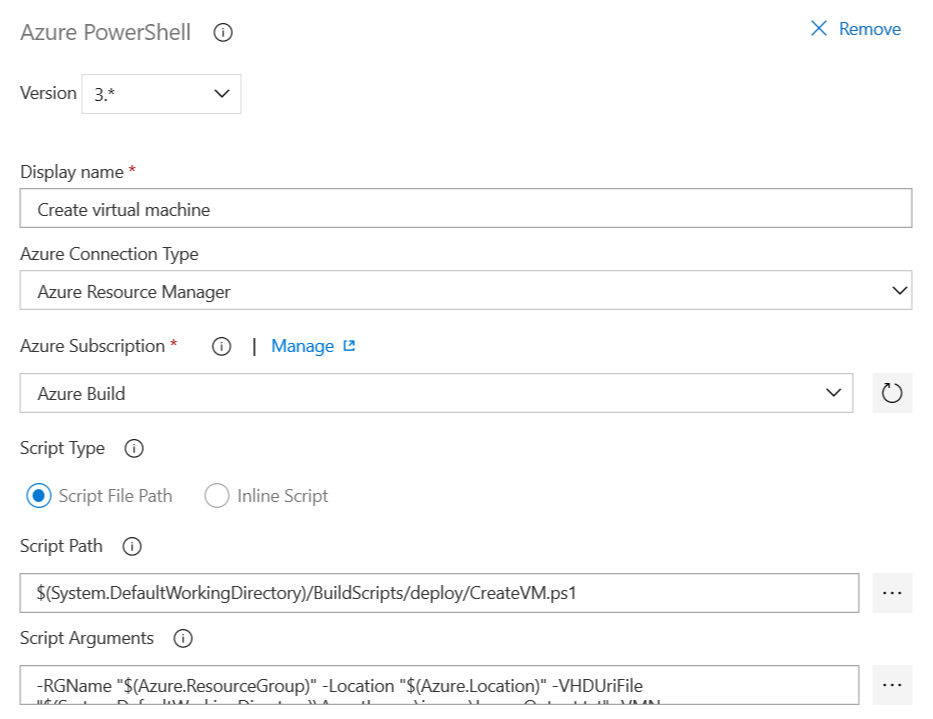

18. At Deployment Process click **Add an agentless job**.

19. Set **Display name** to "Wait for virtual machine".

20. Add task **Delay** and set properties:
    - **Display name**: Delay by 2 minutes
    - **Delay time (minutes)**: 2

21. At Deployment Process click **Add an agent job**.

22. Set properties of the job:
    - **Display name**: Install build agent
    - **Agent pool**: Hosted VS2017

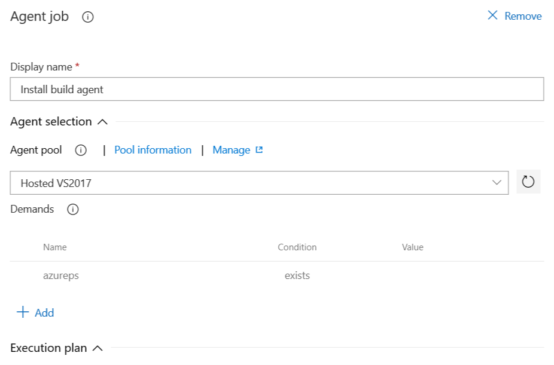

23. Add task **PowerShell** and set properties:
    - **Display name**: Delete old build agent
    - **Type**: File Path
    - **Script Path**: `$(System.DefaultWorkingDirectory)/BuildScripts/deploy/DeleteAgent.ps1`
    - **Script Arguments**: `-VstsUrl "$(System.TeamFoundationCollectionUri)" -AuthToken "$(ADOAccount.PAT)" -AgentName "$(Azure.VirtualMachinePrefix)*"`
    - **ErrorActionPreference**: Stop

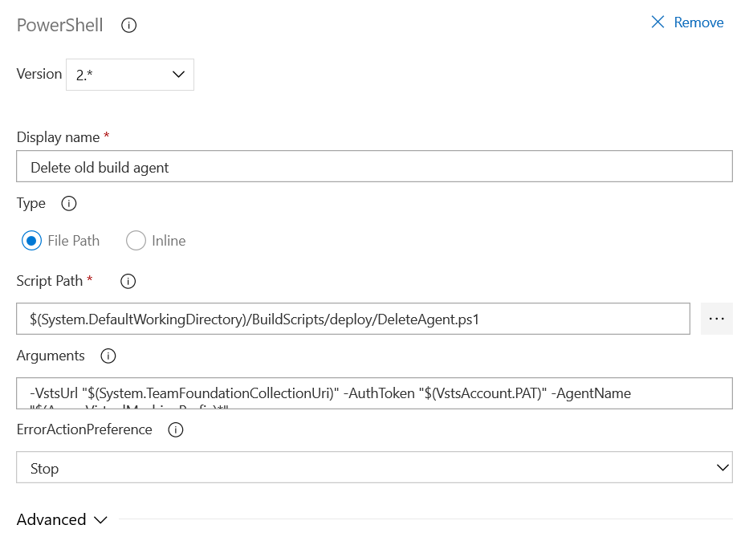

24. Add task **Azure PowerShell** and set properties:
    - **Display name**: Install build agent
    - **Azure Connection Type**: Azure Resource Manager
    - **Azure Subscription**: Azure Build
    - **Script Type**: Script File Path
    - **Script Path**: `$(System.DefaultWorkingDirectory)/BuildScripts/deploy/InstallAgent.ps1`
    - **Script Arguments**: `-RGName "$(Azure.ResourceGroup)" -VMName "$(Azure.VirtualMachinePrefix)$(Release.ReleaseId)R" -Username "$(BuildAgent.Username)" -Password "$(BuildAgent.Password)" -VstsUrl "$(System.TeamFoundationCollectionUri)" -PAT "$(ADOAccount.PAT)" -VSTSAgentUrl "$(ADOAccount.AgentUrl)"`
    - **ErrorActionPreference**: Stop
    - **Azure PowerShell Version**: Latest installed version

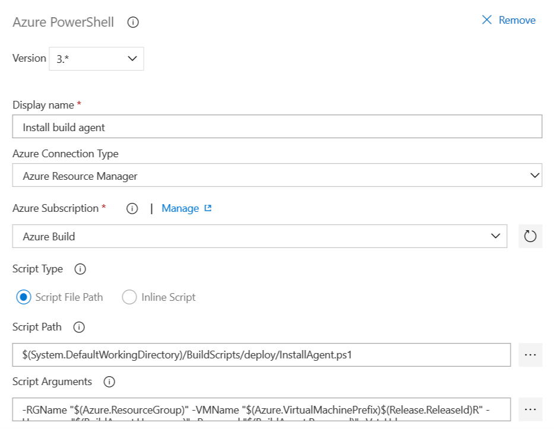

25. At Deployment Process click **Add an agentless job**.

26. Set **Display name** to "Wait for build agent".

27. Add task **Delay** and set properties:
    - **Display name**: Delay by 2 minutes
    - **Delay time (minutes)**: 2

28. At Deployment Process click **Add an agent job**.

29. Set properties of the job:
    - **Display name**: Delete old virtual machine
    - **Agent pool**: Default

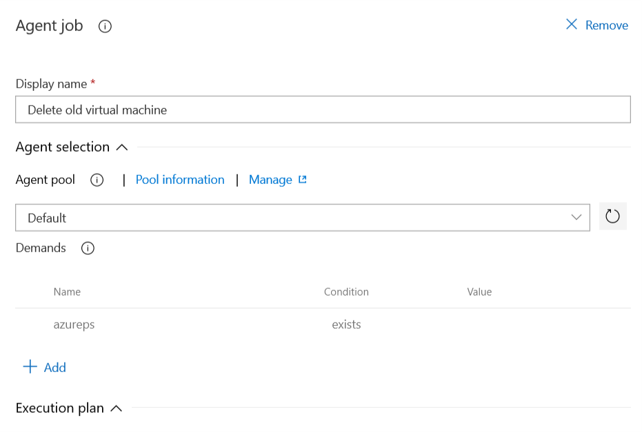

30. Add task **Azure PowerShell** and set properties:
    - **Display name**: Delete old virtual machine
    - **Azure Connection Type**: Azure Resource Manager
    - **Azure Subscription**: Azure Build
    - **Script Type**: Script File Path
    - **Script Path**: `$(System.DefaultWorkingDirectory)/BuildScripts/deploy/DeleteVMs.ps1`
    - **Script Arguments**: `-RGName "$(Azure.ResourceGroup)" -ExceptVMs @("$(Agent.MachineName)")`
    - **ErrorActionPreference**: Stop
    - **Azure PowerShell Version**: Latest installed version

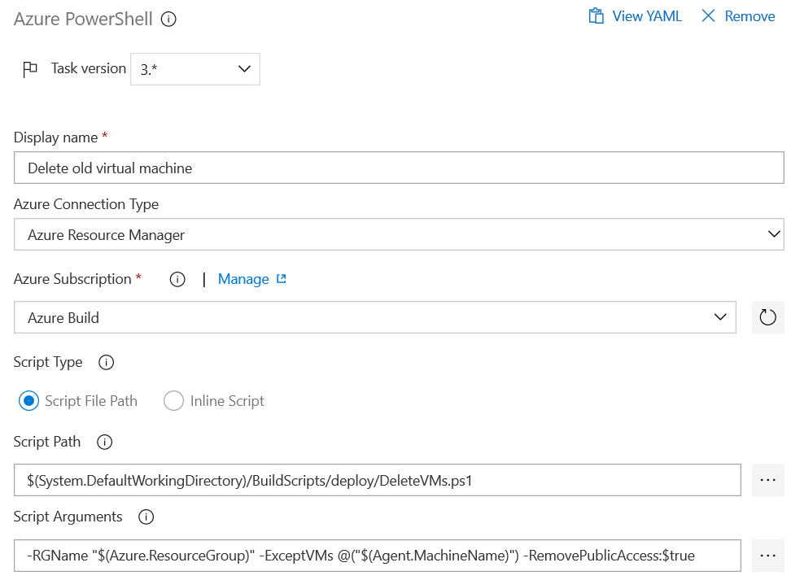

31. **Save** the release pipeline and name it _Azure DevOps Build Agent_.
32. Click **Create a release**. Confirm build versions to use and click **Create**.

After about 30 minutes the release should be finished and you should have your build agent ready.
