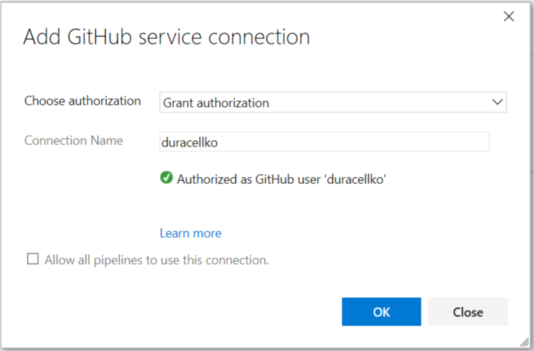
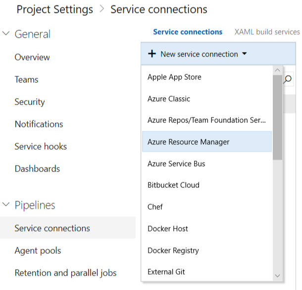
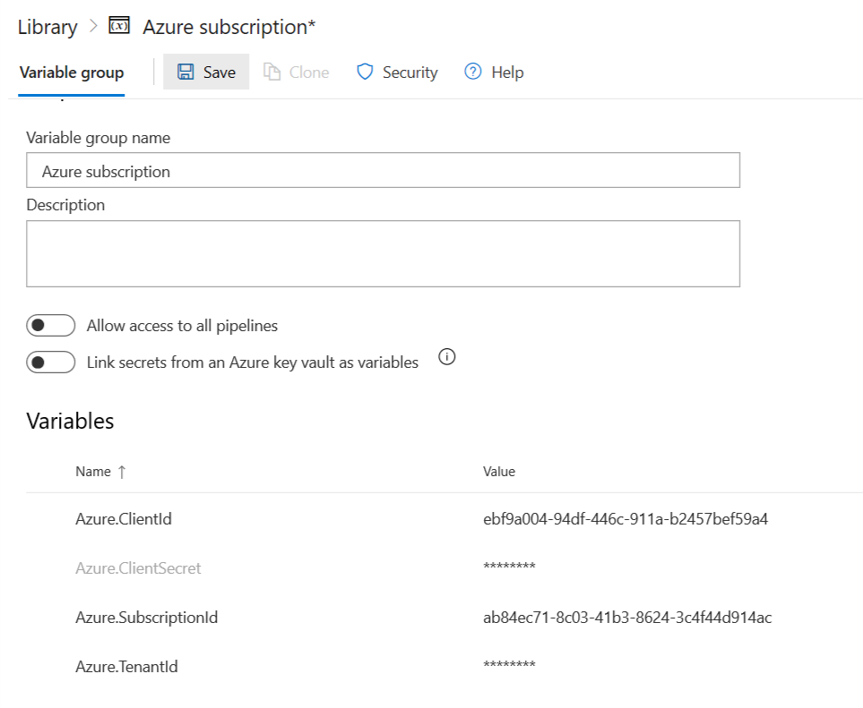
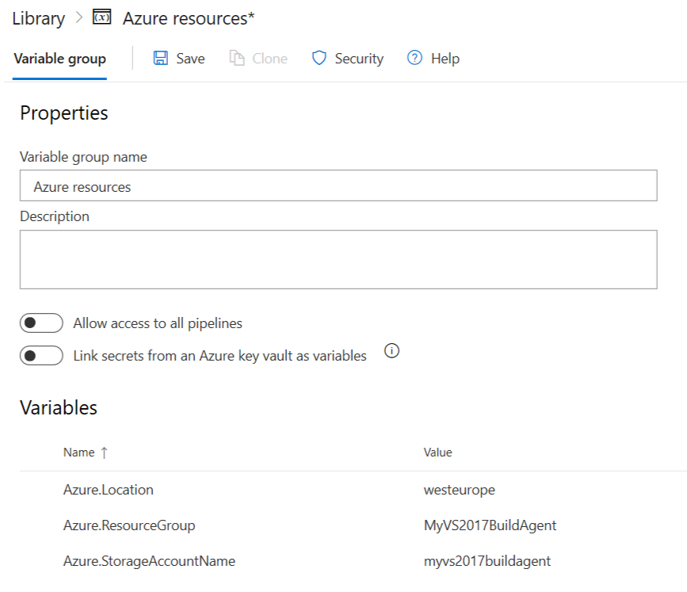
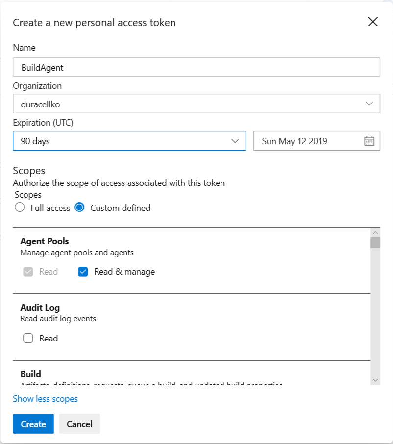
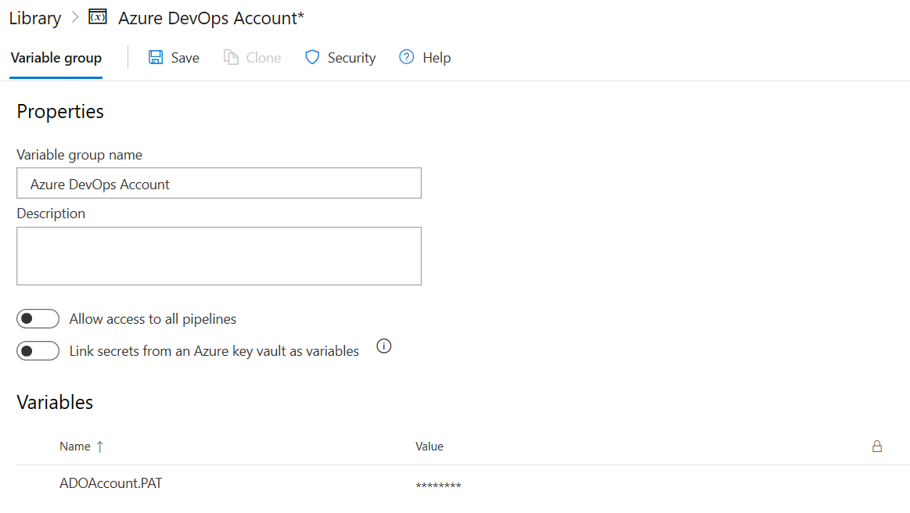
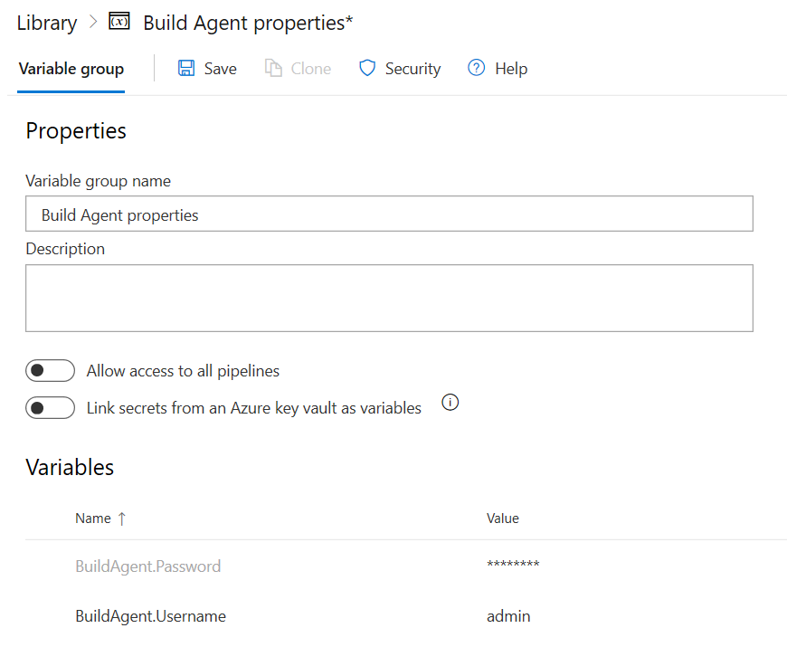

# Setup Azure DevOps project

## 1. Publish build scripts

This task publishes scripts from this repository, so they are available for other Azure Pipelines.

1. Fork this repository in GitHub.
2. Open Azure DevOps project, where you want to setup pipeline. Or create a new one.
3. Open **Project Settings**.
4. Open **Service Connections**.
5. Click **New service connection** and select **GitHub**.

6. Enter connection name and click **Authorize**. Optionally you can uncheck **Allow all pipelines to use this connection.** as this is not needed in our scenario.

7. Click **OK**.
8. From menu select **Pipelines** then **Builds**.
9. Create **New build pipeline**.
10. Click **Use the visual designer**.

11. Select **GitHub** as source and select your forked repository.

12. Click **Continue**.
13. Select **YAML** and click **Apply**.
14. Enter name following values
    - **Name**: _Build scripts_
    - **Agent pool**: Hosted Windows Container
    - **YAML file path**: azure-pipelines.yml

15. Click **Save & queue** and queue new build.

## 2. Create connection to Azure Subscription

1. Open **Project Settings**.
2. Open **Service Connections**.
3. Click **New service connection** and select **Azure Resource Manager**.

4. You can uncheck **Allow all pipelines to use this connection.** as this is not needed in our scenario.
5. Select **Service Principal Authentication**.
6. Click **use the full version of the service connection dialog**. Dialog with all options is displayed.
7. Enter following values:
    - **Connection name**: Azure build
    - **Environment**: AzureCloud
    - **Scope level**: Subscription
    - **Subscription ID**: Subscription ID of your Azure subscription.
    - **Subscription name**: Name of your Azure subscription.
    - **Service principal client ID**: $spClientId returned by _SetupPacker.ps1_ script.
    - **Service principal key**: $spClientSecret returned by _SetupPacker.ps1_ script.
    - **Tenant ID**: $tenantId returned by _SetupPacker.ps1_ script.

8. Click **Verify connection** and then click **OK**.

## 3. Setup build variables

1. From menu select **Pipelines** then **Library**.
2. Open **Variable groups**.
3. Create new variable group named **Azure subscription** with following values:

| Name                 | Value                                                 | Hidden |
|----------------------|-------------------------------------------------------|--------|
| Azure.ClientId       | $spClientId returned by _SetupPacker.ps1_ script.     |        |
| Azure.ClientSecret   | $spClientSecret returned by _SetupPacker.ps1_ script. | true   |
| Azure.SubscriptionId | Subscription ID of your Azure subscription.           |        |
| Azure.TenantId       | $tenantId returned by _SetupPacker.ps1_ script.       | true   |

4. You can uncheck **Allow access to all pipelines** as this is not needed in our scenario.

5. Click **Save**.
6. Create new variable group named **Azure resources** with following values:

| Name                     | Value                                                     |
|--------------------------|-----------------------------------------------------------|
| Azure.Location           | $location returned by _SetupPacker.ps1_ script.           |
| Azure.ResourceGroup      | $rgName returned by _SetupPacker.ps1_ script.             |
| Azure.StorageAccountName | $storageAccountName returned by _SetupPacker.ps1_ script. |

7. You can uncheck **Allow access to all pipelines** as this is not needed in our scenario.

8. Click **Save**.
9. In menu open **Project settings** and then **Agent pools**.
10. Select _Default_ pool.
11. Click **Download agent**.
12. Select **Windows** and then **x64**.
13. Click **Copy URL to clipboard** button next to **Download**. Save the URL for later user.

14. Click user icon in upper right corner and select **Security**.
15. Select **Personal access tokens**.
16. Click **New Token**.
17. Set **Name** to "BuildAgent".
18. Set **Expiration** to 90 days.
19. Click **Show all scopes**.
20. Check **Agent Pools - Read & manage**.

21. Click **Create**.
22. Save create token for later use.
23. From menu select **Pipelines** then **Library**.
24. Open **Variable groups**.
25. Create new variable group named **Azure DevOps Account** with following values:

| Name                | Value                                      | Hidden |
|---------------------|--------------------------------------------|--------|
| ADOAccount.AgentUrl | Download agent URL obtained in step 13.    |        |
| ADOAccount.PAT      | Personal Access Token obtained in step 22. | true   |

26. You can uncheck **Allow access to all pipelines** as this is not needed in our scenario.

27. Click **Save**.
25. Create new variable group named **Build Agent properties** with following values:

| Name                | Value                                          | Hidden |
|---------------------|------------------------------------------------|--------|
| BuildAgent.Password | Password of admin user created on build agent. | true   |
| BuildAgent.Username | Username of admin user created on build agent. |        |

26. You can uncheck **Allow access to all pipelines** as this is not needed in our scenario.

27. Click **Save**.

Next step: [Create build agent image](Create_build_agent_image.md)
